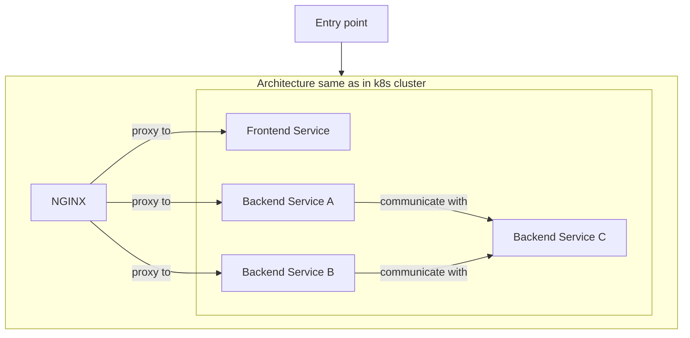
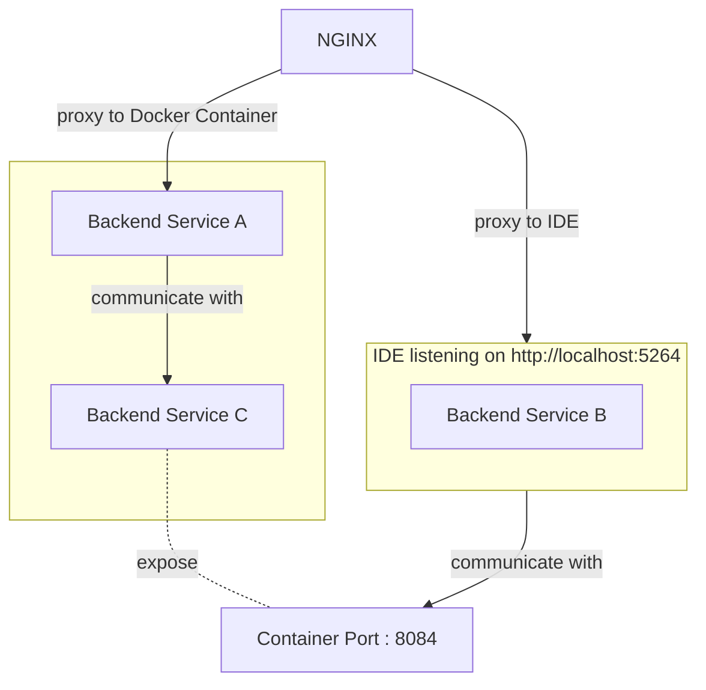
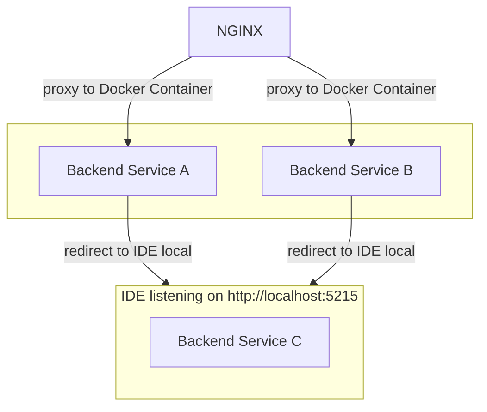

# Use Docker Compose for local Microservice developing and debugging

## When could this be useful?

When developing applications with only a few services (e.g. MVP, simple apps) but different teams we often need a 'simple' way to debug/test **our** services in interaction with other services locally. Provisioning a local k8s cluster like in the cloud environment may be suitable, but sometimes this is just a massive overhead (preparing, maintaining, fixing, ...).

Instead of running a local k8s cluster (that comes with its own issues and difficulties) another solution is to "simulate" the same microservice architecture by using "Docker Compose". This is easier to prepare and maintain (e.g. no need to install a k8s distribution such as k3s, kind or minikube). Finally running a simple 

> `docker compose -f "docker-compose-local.yaml" up -d` 

is all we need.

### Restrictions
- no service mesh
- no api gateway
- uses a reverse proxy (e.g. NGINX)

Info: install Mermaid for VSCode to preview architecture [Mermaid Preview Extension](https://marketplace.visualstudio.com/items?itemName=bierner.markdown-mermaid)

## Used sample architecture



### Entry point

This is a external IP to access the application (or may be a load balancer in front of k8s).  
For this sample we use http://localhost:8080 (NGINX exposed by Docker Desktop).

### Reverse proxy NGINX 

NGINX is often used as reverse proxy to provide one [API endpoint for different services](https://www.nginx.com/blog/deploying-nginx-plus-as-an-api-gateway-part-1/). Service discovery/DNS is done by k8s or local with Docker-Compose.

### Services

- Frontend service (e.g. Angular). 
- Backend services A, B and C (e.g. REST APIs).
- Service A and service B depend on functionality provided by service C.

Each service is packed in its own Docker container, adhering to [microservice architecture](https://learn.microsoft.com/en-us/dotnet/architecture/microservices/architect-microservice-container-applications/).

## Run entire application in (local) Docker containers
```shell
docker compose -f docker-compose-local.yaml up
```

## Debugging `Backend Service B`: redirecting traffic to local IDE



1. Stop container `nginx-reverse-proxy`
2. Change location proxy of `Backend Service B` in [nginx.conf](nginx.conf) to:
```yaml
    location /api/a/ {
      rewrite ^/api/a/(.*)$ http://localhost:5264/$1 permanent; # use this for local redirection 
    }
```
3. Change the `appsettings.Development.json` in the local developent environment to redirect traffic to the with [docker-compose-local.yaml](docker-compose-local.yaml) exposed port 8084 from `Backend Service C`:
```json
  "ServiceEdpoints": {
    "service-c": "http://localhost:8084"
  }
```
4. Start IDE (listening on port 5264)
5. Re-start container `nginx-reverse-proxy`
6. Opening a browser on [http://localhost:8080/api/a/](http://localhost:8080/api/a/) will then redirect traffic to the IDE listening on [http://localhost:5263/](http://localhost:5263/) -> 
e.g. [http://localhost:8080/api/a/weatherforecast](http://localhost:8080/api/a/weatherforecast) will result in [http://localhost:5263/weatherforecast](http://localhost:5263/weatherforecast)


## Debugging `Backend Service C`: redircting traffic to local IDE

1. Shut down all containers
```shell
docker compose -f docker-compose-local.yaml down
```
2. Change the `appsettings.Docker.json` in Service A and B to redirect the traffic to the IDE:
```json
  "ServiceEdpoints": {
    "service-c": "http://host.docker.internal:5215"
  }
```
3. 
```shell
docker compose -f docker-compose-local.yaml up
```

To recive traffic from `Backend Service A` in `Backend Service C` use the endpoints provided by Docker Desktop on `http://host.docker.internal`

For a running the service on your local computer, listening on e.g. port 5215, this results in:  
`http://host.docker.internal:5215` 


## Docker image tags
For the sake of simplicity, the repo contains .env files to set environment variables used as images tags in docker-compose files. Normally, you wouldn't check in the .env file.
